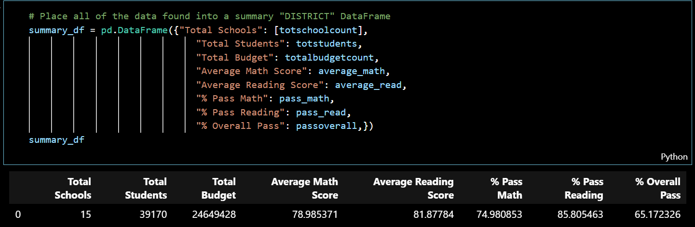
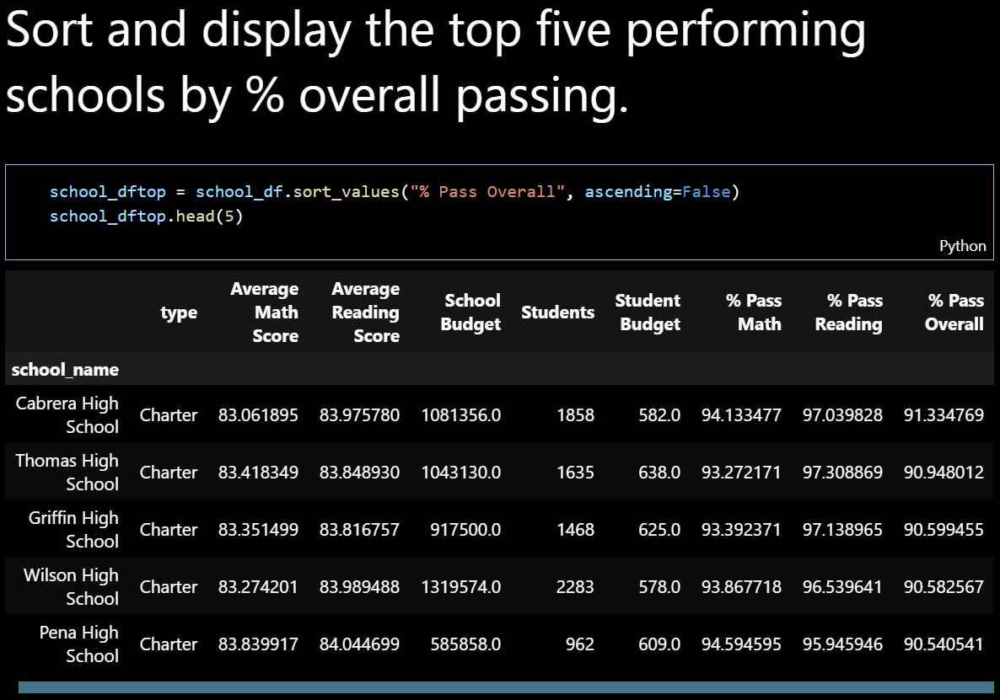
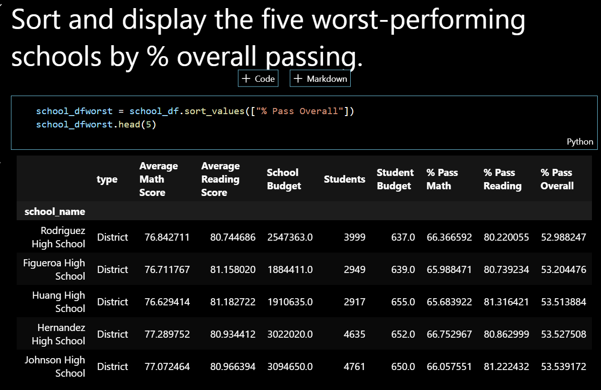

# pandas-challenge
Pandas-challenge Pandas, Pandas, Pandas

PyCitySchools

Analysis helping the school board and mayor make strategic decisions regarding future school budgets and priorities.

The main code written in Jupyter Notebook is in the folder called PyCitySchools. A resources folder contains the data.

Two observable trends based on the data:

1.) The District Summary shows that overall students performed better in Reading than Math. 85.80% of students passed Reading compared to just 74.98% passing Math. The Overall Pass % was just 65.17% showing that much less students passed both Reading and Math. 

2.) The top 5 performimg schools obtained excelent overall pass results between 90% and 91% and the budget per student was between $578 and $638.

 The worst performing schools obtained poor overall pass results between 52% and 53% and the budget per student was between $637 and $655.

This indicates that a high per student budget does not necessarily result in increased pass results.
  